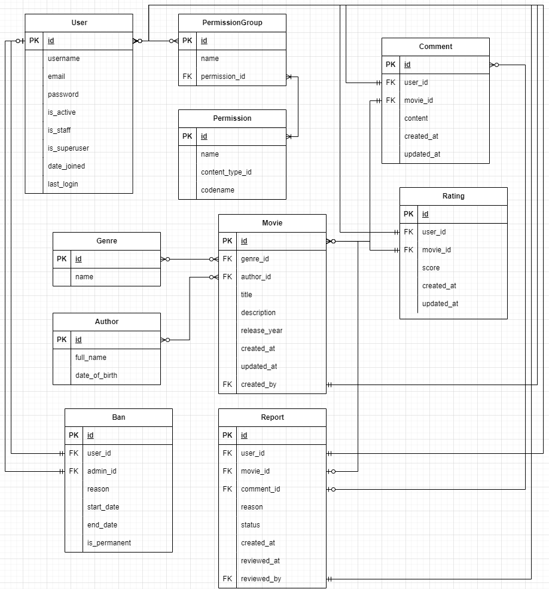

# MoviePulse: Tiered Movie Rating & Discussion Platform

MoviePulse is a centralized web application for movie enthusiasts to discover, rate, and discuss films.
The platform is implemented as a database-driven web application using Django and follows a layered architecture
with role-based access control ranging from guests to superadmins.

[](https://opensource.org/licenses/BSD-3-Clause)

#### Contents:
- [Analysis](#analysis)
    - [Scenario](#scenario)
    - [User Stories](#user-stories)
    - [Use Case](#use-case)
- [Design](#design)
    - [Domain Design](#domain-design)
    - [ER Diagram](#er-diagram)
    - [Business Logic](#business-logic)
- [Implementation](#implementation)
    - [Backend Technology](#backend-technology)
    - [Frontend Technology](#frontend-technology)
- [Project Management](#project-management)
    - [Roles](#roles)
    - [Milestones](#milestones)

---

## Analysis

### Scenario
MoviePulse is a movie database application that allows users to interact with film data based on 
their authorization level. While public users can browse content, authenticated users contribute to the 
community via ratings and comments. Higher-tier roles (Editors and Admins) ensure 
data quality by managing metadata and moderating discussions.

### User Levels

| Level | Role Name      | Permissions & Capabilities |
| :---: | :------------- | :--- |
| **0** | **Guest**      | **Unauthorized:** Can access the main page, browse a public subset of the movie library, use filters, open movie detail pages, read ratings and comments, register an account, and report incorrect movie information or inappropriate comments. |
| **1** | **User**       | **Authenticated:** Includes all Guest permissions. Can log in and log out, rate movies, add comments, edit or delete own comments, and update account details. Limited to one rating per movie. |
| **2** | **Editor**     | **Content Curator:** Includes all User permissions. Can create new movie records, edit existing movie records, and review reported movie information to maintain data quality. |
| **3** | **Admin**      | **Moderator:** Includes all Editor permissions. Can delete inappropriate comments, review reported comments, ban users, and manage movie records with full CRUD functionality when necessary. |
| **4** | **Superadmin** | **System Owner:** Includes all Admin permissions. Has full CRUD authority over all entities, can manage privileged accounts and permissions, and can access protected administrative views and system-level controls. |

### User Stories (To be extended)
1. **As a [Guest]**, I want to access the main page without logging in so that I can immediately use the platform.
2. **As a [Guest]**, I want to browse a public list of movies so that I can discover available content.
3. **As a [Guest]**, I want to filter movies by attributes such as title, genre, or year so that I can find specific movies more efficiently.
4. **As a [Guest]**, I want to open a movie detail page so that I can view detailed information about a selected movie.
5. **As a [Guest]**, I want to see ratings and comments for a movie so that I can understand community opinions before deciding to watch it.
6. **As a [Guest]**, I want to register an account so that I can participate in rating and discussion features.
7. **As a [Guest]**, I want to report incorrect movie information so that editors or admins can review possible errors.
8. **As a [Guest]**, I want to report vulgar or inappropriate comments so that the platform remains respectful and useful.
9. **As a [Guest]**, I want to use the application on desktop and mobile devices so that I can access it comfortably from different devices.

10. **As a [User]**, I want to log in securely so that I can access authenticated features.
11. **As a [User]**, I want to log out so that I can safely end my session on a shared or personal device.
12. **As a [User]**, I want to rate a movie so that I can express my opinion numerically.
13. **As a [User]**, I want to comment on a movie so that I can share my thoughts with other users.
14. **As a [User]**, I want to edit my own comments so that I can correct mistakes or improve my contribution.
15. **As a [User]**, I want to delete my own comments so that I can remove content I no longer want to publish.
16. **As a [User]**, I want to edit my account details so that my profile information stays current.
17. **As a [User]**, I want the system to allow only one rating per movie per account so that ratings remain fair and consistent.

18. **As an [Editor]**, I want to create new movie records so that newly released or missing movies can be added to the platform.
19. **As an [Editor]**, I want to edit existing movie records so that wrong or incomplete movie information can be corrected.
20. **As an [Editor]**, I want to review reported movie entries so that flagged content can be checked and improved.

21. **As an [Admin]**, I want to delete inappropriate comments so that community rules can be enforced.
22. **As an [Admin]**, I want to review reported comments so that harmful or vulgar discussion content can be moderated.
23. **As an [Admin]**, I want to ban users who repeatedly violate platform rules so that abuse of the system is reduced.
24. **As an [Admin]**, I want to manage movie records with full CRUD functionality so that I can maintain content quality when needed.

25. **As a [Superadmin]**, I want to manage all system entities so that I have full control over the platform.
26. **As a [Superadmin]**, I want to manage privileged accounts and permissions so that the authorization hierarchy remains secure and correct.
27. **As a [Superadmin]**, I want to access a protected admin view so that I can supervise platform data and administration functions.
28. **As a [Superadmin]**, I want the system to enforce role hierarchy rules so that lower-level users cannot perform actions above their authority.

### Use Cases

The following use cases define the functional requirements of the MoviePulse platform.  
They are grouped by business area to reflect the main responsibilities of the system: account and access management, movie and community interaction, and moderation and enforcement workflows.

---

#### 100 – Account and Access Management

- **UC-100 [Account Management Overview]:**  
  Covers all functionality related to user registration, authentication, session handling, account profile maintenance, account status, and role and permission administration. It includes both self-service account actions performed by guests or authenticated users and privileged account-management actions performed by superadmins.

- **UC-101 [Register Account]:**  
  Allows a guest to create a new MoviePulse account by providing the required registration data such as username, email, and password. The system validates the input, creates a user together with a related user profile, assigns the default role **USER**, and stores the account in active status if registration succeeds.

- **UC-102 [Log In]:**  
  Allows a registered user to authenticate using valid credentials. After successful authentication, the system creates a session and grants access to authenticated features according to the user’s assigned role and permissions.

- **UC-103 [Log Out]:**  
  Allows an authenticated user to terminate their active session. The system invalidates the session and returns the user to guest-level access.

- **UC-104 [View Own Profile]:**  
  Allows an authenticated user to access their own account and profile information. The system returns the currently stored account-related information such as username, email, role, status, and profile metadata.

- **UC-105 [Update Own Account Details]:**  
  Allows an authenticated user to edit their own account information, such as email and other permitted profile details. The system validates the new values and updates the related user and profile records while preserving role integrity and access constraints.

- **UC-106 [Restrict Account Access]:**  
  Allows the system or privileged administrators to restrict a user’s effective access through status changes such as bans or inactive states. This use case does not necessarily delete the account but prevents the user from using protected functionality according to moderation outcomes.

- **UC-107 [Assign or Change User Role]:**  
  Allows a superadmin to change a user’s platform role, for example promoting a normal user to **EDITOR**, **ADMIN**, or **SUPERADMIN**, or demoting privileged users when required. The system must ensure that role changes remain consistent with the corresponding permission groups and authorization hierarchy.

- **UC-108 [Synchronize Permissions]:**  
  Ensures that a user’s effective permissions match their assigned platform role. When a role is created, updated, promoted, or reduced, the system synchronizes the linked group or permission set so that authorization remains consistent across the platform.

- **UC-109 [Access Protected Administrative Views]:**  
  Allows privileged users, especially superadmins, to access protected administrative views and system-level controls. The system checks role and permission requirements before granting access to internal administration areas.

- **UC-110 [Validate Account Rules]:**  
  Ensures that account-related rules are enforced across all account actions. Examples include preventing invalid registrations, rejecting invalid login credentials, denying protected operations to guests, and ensuring banned or restricted users cannot use features beyond their allowed scope.

---

#### 200 – Movie and Community Interaction

- **UC-200 [Movie and Community Interaction Overview]:**  
  Covers all core platform interaction with movie records and community contributions. It includes public browsing, viewing details, filtering and searching, and authenticated user interactions such as ratings and comments, as well as privileged movie maintenance actions.

- **UC-201 [Browse Movie Catalog]:**  
  Allows guests and authenticated users to access the public movie list. The system displays a browseable subset or public catalog of movies and makes it possible to discover available titles without requiring login.

- **UC-202 [Filter and Search Movies]:**  
  Allows guests and authenticated users to narrow the movie list using supported search and filter criteria such as title, genre, and release year. The system returns only the movies that match the requested conditions.

- **UC-203 [View Movie Details]:**  
  Allows guests and authenticated users to open a specific movie detail page. The system shows the stored movie metadata and associated community content such as ratings and comments.

- **UC-204 [View Ratings for a Movie]:**  
  Allows guests and authenticated users to view ratings associated with a movie. The system retrieves the rating entries and presents the rating information linked to the selected movie.

- **UC-205 [View Comments for a Movie]:**  
  Allows guests and authenticated users to view the discussion associated with a movie. The system retrieves visible comments connected to the selected movie and displays them as part of the movie community area.

- **UC-206 [Create Movie Record]:**  
  Allows an **Editor**, **Admin**, or **Superadmin** to create a new movie entry in the platform. The system validates the submitted movie data and stores a new movie record including required metadata such as title, description, release year, genre information, and creator-related data.

- **UC-207 [Update Movie Record]:**  
  Allows an **Editor**, **Admin**, or **Superadmin** to edit an existing movie record in order to correct or enrich movie information. This includes maintaining movie metadata and related classification or creator information where applicable.

- **UC-208 [Delete Movie Record]:**  
  Allows an **Admin** or **Superadmin** to remove a movie record from the platform when deletion is necessary. The system restricts this action to sufficiently privileged roles and applies the deletion to the selected movie entity.

- **UC-209 [Create Rating]:**  
  Allows an authenticated **User**, **Editor**, **Admin**, or **Superadmin** to submit a numeric rating for a movie. The system creates the rating only if the user has not already rated that movie, thereby enforcing the one-rating-per-user-per-movie business rule.

- **UC-210 [Update Own Rating]:**  
  Allows an authenticated user to change their own previously submitted rating for a movie. The system updates only the rating belonging to the currently authenticated user.

- **UC-211 [Delete Own Rating]:**  
  Allows an authenticated user to remove their own existing rating from a movie. The system ensures that users may delete only their own rating entry.

- **UC-212 [Create Comment]:**  
  Allows an authenticated user to post a textual comment on a movie. The system stores the comment together with the author, target movie, timestamps, and comment status.

- **UC-213 [Update Own Comment]:**  
  Allows the author of a comment to edit their own contribution. The system validates authorship and updates the comment content and modification timestamp.

- **UC-214 [Delete Own Comment]:**  
  Allows the author of a comment to remove their own published comment from the platform. The system verifies ownership before deletion.

- **UC-215 [Moderated Comment Editing or Removal]:**  
  Allows privileged moderators, especially admins, to edit or delete comments when moderation is required. This extends beyond normal self-service comment management and supports enforcement of community standards.

- **UC-216 [Maintain Movie Data Quality]:**  
  Supports ongoing maintenance of movie metadata by privileged roles. This includes correcting incorrect entries, completing incomplete information, and ensuring movie records remain consistent with domain rules.

---

#### 300 – Reports, Moderation, and Enforcement

- **UC-300 [Moderation and Enforcement Overview]:**  
  Covers all workflows related to reporting incorrect or inappropriate content, reviewing submitted reports, moderating comments, banning users, and enforcing platform rules. These use cases support quality control, community safety, and traceable administrative intervention.

- **UC-301 [Submit Movie Report]:**  
  Allows a guest or authenticated user to report incorrect movie information. The report identifies the target movie, includes a reason, may include an optional description, and enters the moderation workflow with an initial pending status.

- **UC-302 [Submit Comment Report]:**  
  Allows a guest or authenticated user to report a vulgar, abusive, or otherwise inappropriate comment. The system stores the report with the targeted comment reference, reason, optional description, and initial review state.

- **UC-303 [View Report Queue]:**  
  Allows an **Editor**, **Admin**, or **Superadmin** to retrieve submitted reports for review. The system returns the current set of reports so that privileged users can inspect pending issues and decide on follow-up actions.

- **UC-304 [View Report Details]:**  
  Allows a privileged reviewer to inspect a specific report in detail, including its target type, target identifier, reason, description, reporter linkage if available, current status, and review metadata.

- **UC-305 [Review and Update Report Status]:**  
  Allows an **Editor**, **Admin**, or **Superadmin** to process a submitted report by changing its status, for example from **PENDING** to **REVIEWED**, **RESOLVED**, or **REJECTED**. The system records the reviewer and review timestamp to support traceability.

- **UC-306 [Review Reported Movie Information]:**  
  Allows editors and higher roles to review reports that concern movie metadata. Based on the review result, the reviewer may correct the movie data, mark the report as resolved, or reject the report if it is invalid.

- **UC-307 [Review Reported Comment Content]:**  
  Allows admins and higher roles to review reports that concern user comments. Based on the outcome, the comment may remain unchanged, be edited in moderation contexts, or be deleted if it violates community rules.

- **UC-308 [Delete Inappropriate Comment]:**  
  Allows an **Admin** or **Superadmin** to remove a comment that violates platform standards, either after a report or through direct moderation. This use case ensures that offensive or harmful discussion content can be removed from public view.

- **UC-309 [Create User Ban]:**  
  Allows an **Admin** or **Superadmin** to ban a user who repeatedly violates platform rules or engages in abusive behavior. The system creates a ban record containing the target user, issuing administrator, reason, start date, optional end date, permanence flag, and active status.

- **UC-310 [View Ban Records]:**  
  Allows an **Admin** or **Superadmin** to retrieve the list of existing user bans. This supports moderation oversight and enforcement tracking.

- **UC-311 [View Ban Details]:**  
  Allows an **Admin** or **Superadmin** to inspect the details of a specific ban, including who was banned, by whom, for what reason, over what time period, and under what current status.

- **UC-312 [Update or Revoke Ban]:**  
  Allows an **Admin** or **Superadmin** to modify an existing ban, such as changing the end date, marking the ban as permanent, or revoking it. The system updates the ban record and preserves enforcement history.

- **UC-313 [Enforce Permanent and Temporary Ban Rules]:**  
  Ensures that ban records remain logically valid. In particular, permanent bans require `is_permanent = true` and do not require an end date, while temporary bans may carry an end date and status transitions such as **ACTIVE**, **EXPIRED**, or **REVOKED**.

- **UC-314 [Maintain Moderation Traceability]:**  
  Ensures that moderation actions remain auditable by storing reviewer identities, timestamps, issued bans, and report statuses. This supports controlled governance of the platform and aligns with the moderation entities present in the domain design.
---

## Design

### Domain Design

The MoviePulse platform is centered around several core domain entities that reflect the functional requirements, user roles, moderation workflows, and technical architecture of the system. The domain design serves as the conceptual foundation for the later ER/EER model and database schema.

For authentication and authorization, the system will rely on Django’s built-in user model and permission framework. Platform-specific user data will be stored in a related profile entity, while role-based access will be represented through a role attribute and synchronized Django permission groups.

### ER Diagram

The ER diagram below reflects the current database structure of the MoviePulse platform.  
It combines custom application entities with Django’s built-in authentication and authorization entities.


* **User** (`id`, `username`, `email`, `password`, `is_active`, `is_staff`, `is_superuser`, `date_joined`, `last_login`)  
  Represents the built-in Django authentication entity used for login, logout, and access control. It stores the core credentials and authentication-related data of registered users. Guests are not stored as persistent records and are treated as unauthorized visitors.

* **PermissionGroup** (`id`, `name`, `permission_id`)  
  Represents a permission group used for role-based authorization in the platform. It stores the group name and links to a permission entry. In the application context, this corresponds conceptually to Django group-based authorization, even though the diagram currently labels it as `PermissionGroup`.

* **Permission** (`id`, `name`, `content_type_id`, `codename`)  
  Represents a permission definition used by the authorization system. It stores the human-readable permission name, the related content type, and the codename used for permission checks.

* **Genre** (`id`, `name`)  
  Represents a movie genre such as Action, Fantasy, Comedy, or Horror.

* **Author** (`id`, `full_name`, `date_of_birth`)  
  Represents an author associated with a movie. It stores the author’s full name and date of birth.

* **Movie** (`id`, `genre_id`, `author_id`, `title`, `description`, `release_year`, `created_at`, `updated_at`, `created_by`)  
  Represents a movie entry in the platform. It stores the core metadata of the movie and links directly to one genre, one author, and the user who created the record.

* **Rating** (`id`, `user_id`, `movie_id`, `score`, `created_at`, `updated_at`)  
  Represents a numeric rating submitted by a user for a movie.

* **Comment** (`id`, `user_id`, `movie_id`, `content`, `created_at`, `updated_at`)  
  Represents a text comment written by a user for a movie.

* **Report** (`id`, `user_id`, `movie_id`, `comment_id`, `reason`, `status`, `created_at`, `reviewed_at`, `reviewed_by`)  
  Represents a moderation report created by a user. A report may reference a movie, a comment, or both, depending on the use case. It also stores the reason, review status, creation timestamp, review timestamp, and the reviewing user.

* **Ban** (`id`, `user_id`, `admin_id`, `reason`, `start_date`, `end_date`, `is_permanent`)  
  Represents a ban issued against a user by another user acting with administrative authority. It stores the reason, validity period, and whether the ban is permanent.

#### Main Relationships
* One **User** can belong to zero or many **PermissionGroups**.
* One **PermissionGroup** can contain zero or many **Users**.
* One **PermissionGroup** is linked to a **Permission** through `permission_id`.
* One **Permission** can be referenced by zero or many **PermissionGroups**.
* One **Genre** can be linked to zero or many **Movies**.
* One **Author** can be linked to zero or many **Movies**.
* One **User** can create zero or many **Movies** through `created_by`.
* One **User** can create zero or many **Ratings**.
* One **User** can create zero or many **Comments**.
* One **User** can create zero or many **Reports**.
* One **User** can review zero or many **Reports**.
* One **Movie** can have zero or many **Ratings**.
* One **Movie** can have zero or many **Comments**.
* One **Movie** can be referenced by zero or many **Reports**.
* One **Comment** can be referenced by zero or many **Reports**.
* One **User** can receive zero or many **Bans**.
* One **User** acting as an administrator can issue zero or many **Bans**.

#### Note on Auth Entities
The ER diagram includes authorization-related structures as part of the overall system design. The project relies on Django’s authentication and authorization concepts, but the diagram currently represents these using the entities `User`, `PermissionGroup`, and `Permission`. These entities are included because access control is part of the actual system structure and affects the business rules of the platform.

### Business Logic
#### Business Rules Reflected in the Domain
* A registered user may submit only **one rating per movie**, but may later update or delete their own rating.
* Guests may browse and report content, but only registered users may rate and comment.
* Users with elevated permissions may create and update movie data.
* Administrators may moderate comments, review reports, and ban users.
* A permanent ban has `is_permanent = true` and no required `end_date`.
* Each movie belongs to exactly **one genre** in the current diagram.
* Each movie is linked to exactly **one author** in the current diagram.
* Each movie record stores exactly one creator through `created_by`.
* User access rights are controlled through the permission-group structure represented in the diagram.
---

## Implementation

### Backend Technology
The backend is implemented using a Python-based web framework:
- **Django** for the core backend architecture, routing, views, templates, authentication, and administrative functionality.
- **Django ORM** for object-relational mapping and database interaction.
- **SQLite** for development and demonstration purposes, with the option to switch to another relational database later if needed.
- **Django Authentication and Authorization System** for login, user groups, and permission management.
- **Django Admin** for internal administrative and moderation functionality.

### Frontend Technology
This application uses a server-rendered web frontend with lightweight client-side enhancements:
- **HTML, CSS, and JavaScript** for the user interface and interactive behavior.
- **Django Templates** for dynamic rendering of pages such as movie lists, detail views, forms, and account-related screens.
- **Responsive Design Principles** to support both desktop and mobile usage.
- **Form-based interaction:** The frontend communicates with the backend primarily through Django views, forms, and rendered templates.
---

## Local Setup and Run

Follow these steps to run the MoviePulse project locally.

### 1. Clone the repository
```bash
git clone <your-repository-url>
cd <your-project-folder>
```
### 2. Create a virtual environment
On Windows:
```bash
py -m venv .venv
```

On macOS/Linux:
```bash
python3 -m venv .venv
```

### 3. Activate the virtual environment
On Windows PowerShell:
```bash
.\.venv\Scripts\Activate.ps1
```

On macOS/Linux:
```bash
source .venv/bin/activate
```

### 4. Install dependencies
```bash
pip install -r requirements.txt
```

### 5. Apply database migrations
```bash
python manage.py migrate
```

### 6. Create a superuser
```bash
python manage.py createsuperuser
```

### 7. Run the development server
```bash
python manage.py runserver
```

The application will then be available at:
```
http://127.0.0.1:8000/
```

The Django admin panel will be available at:
```
http://127.0.0.1:8000/admin/
```

### 8. Optional: create new migrations after model changes
If the data model changes, generate and apply new migrations:
```bash
python manage.py makemigrations
python manage.py migrate
```

### Notes
- Make sure the virtual environment is activated before running Django commands.
- `manage.py` is the standard Django project command-line entry point used for migrations, superuser creation, and starting the development server.
- Once dependencies are finalized, generate a `requirements.txt` file for easier collaboration and reproducibility:
```bash
pip freeze > requirements.txt
```
___

## Project Management

### Roles 
- **Backend Developer:** Vávra Kryštof (Spring Boot architecture, Security, SQL Integration).
- **Frontend Developer:** Vávra Kryštof (UI/UX Design, Vanilla JS, Budibase views).
- **Project Lead:** Vávra Kryštof (Documentation, API Design, Milestone tracking).

### Milestones
- [x] **1. Decide use case; Team finalized:** Initial scenario ideation.
- [x] **2. Create project description in Readme:** Analysis and user story definition.
- [ ] **3. Draft API list:** Definition of endpoints in Swagger.
- [ ] **4. Initial backend setup:** Spring Boot 3.0 project initialization.
- [ ] **5. First Web services implemented:** CRUD operations for Movie entity.
- [ ] **6. Web services implemented:** Rating and Comment logic completion.
- [ ] **7. Enable Basic Authentication:** Securing API endpoints.
- [ ] **8. Decide Front-end Strategy:** Finalizing hybrid JS/Low-code approach.
- [ ] **9. Front-end Implementation:** Prototyping and realizing UI functionality.
- [ ] **10. Front-end integrated:** Connecting UI to REST APIs.
- [ ] **11. Project Submission:** 14.06.2026.

#### Maintainer
- Vávra Kryštof

#### License
- [BSD 3-Clause License](https://opensource.org/licenses/BSD-3-Clause)
